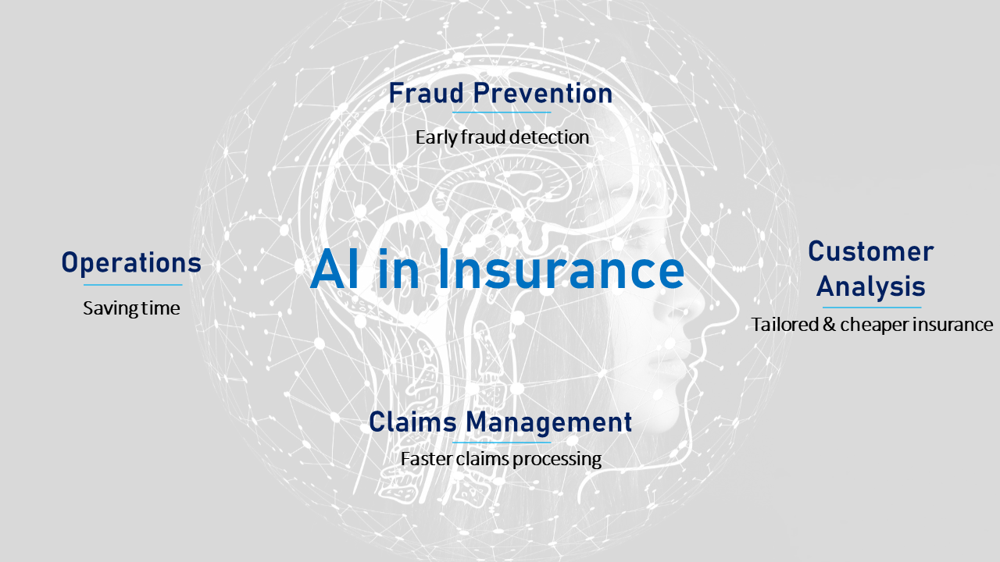

# AI In Insurance
**Austin Peay State University**

<!-- PROJECT LOGO -->
 

  
  
  

# Background
With the power of the cloud and today’s rapidly changing technologies, forward-thinking insurers can leverage Artificial Intelligence to drive faster and more personalized customer experiences, increasing satisfaction with claimants and generating significant efficiencies in insurance underwriting. The vision is that by 2030, AI could make more impact in the services they provide, and this evolution will shift insurance from its current state of “detect and repair” to “predict and prevent,” transforming every aspect of the industry in the process.

### Key areas of AI in Insurance:
 
•	Claim processing
•	Client Journey
•	Fraud Detection
•	Customer retention and churn prediction
•	Operation process optimization
•	Risk Assessment 

As we move forward in this project, we will streamline our focus to AI for Insurance Fraud detection

